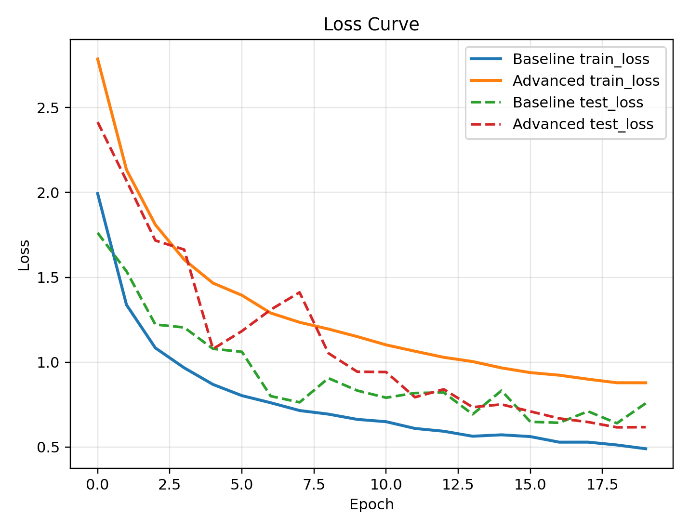
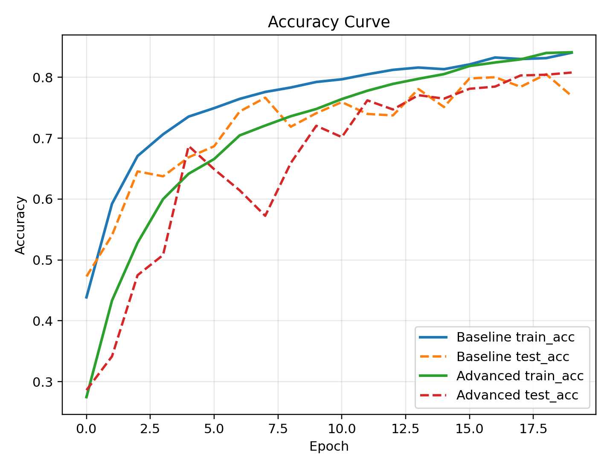
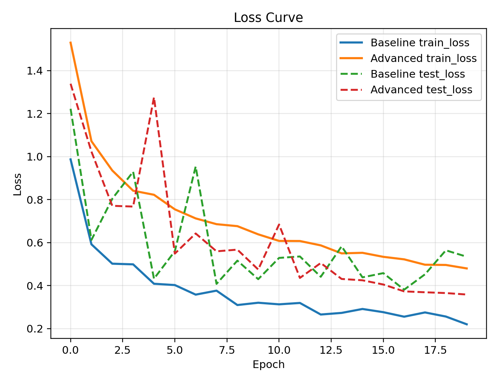
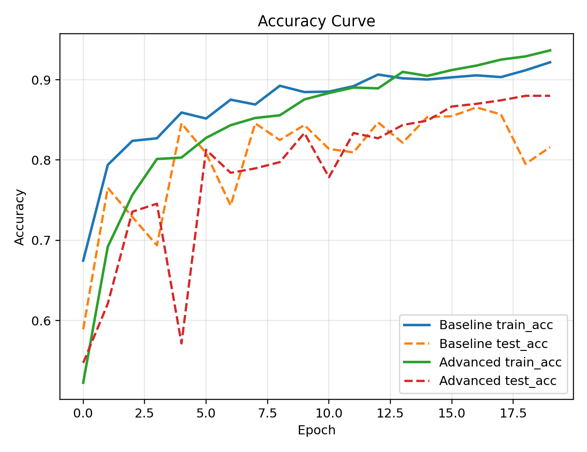
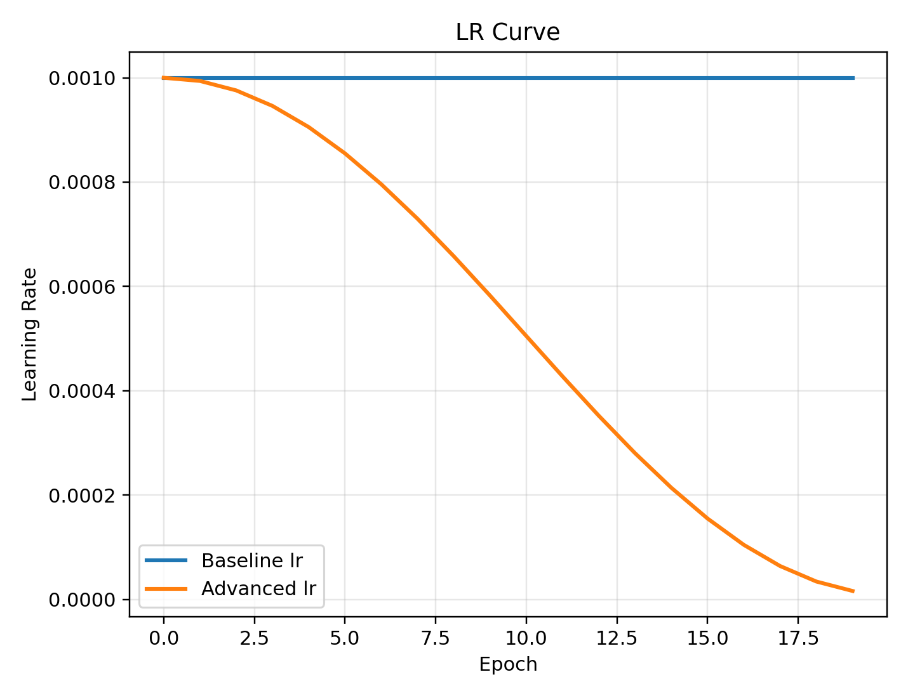

# Colab Final Runtime Folder Guide

This folder is the consolidated Colab-ready entry for final submission.

It centralizes the code and scripts intended to run directly on Google Colab, making submission and reproduction easier.

## File Guide

- `colab_setup.sh`: clones dependency repos, installs environment, downloads ModelNet40 with multi-mirror fallback, and automatically builds a ModelNet10 subset as the second dataset
- `train_classification_h5.py`: PointNet classification training entry (compatible with `modelnet40_ply_hdf5_2048`)
- `train_baseline.sh`: runs PointNet baseline training (ModelNet40 main track)
- `train_cross_dataset.sh`: runs PointNet cross-dataset training (ModelNet10 subset)
- `train_advanced_modelnet10.sh`: runs PointNet advanced training (ModelNet10 subset, robustness validation)
- `train_dgcnn.sh`: runs DGCNN comparison training
- `train_advanced.sh`: **[2.2]** runs PointNet advanced extension (label smoothing + scale augment + feature transform + CSV logging)
- `package_modelnet10_compare.sh`: collects and packages ModelNet10 Baseline vs Advanced artifacts
- `package_final.sh`: one-command collection to `final/` and packaging into `final_submission.zip`

## Recommended Execution Order (Colab)

> Both invocation styles are supported:
> - Run from repository root: `bash colab_final/<script_name>.sh`
> - Upload this folder to Colab and run inside it: `bash <script_name>.sh`

1. Upload or clone this repository into your Colab working directory.
2. Prepare environment:

```bash
bash colab_final/colab_setup.sh
```

3. Run baseline training (ModelNet40):

```bash
bash colab_final/train_baseline.sh
```

4. Run cross-dataset training (ModelNet10 subset):

```bash
bash colab_final/train_cross_dataset.sh
```

5. Run DGCNN comparison experiment:

```bash
bash colab_final/train_dgcnn.sh
```

6. **[2.2]** Run advanced extension experiment (Advanced Requirement 2.2):

```bash
bash colab_final/train_advanced.sh
```

7. Run ModelNet10 Advanced training (robustness validation):

```bash
bash colab_final/train_advanced_modelnet10.sh
```

8. Package ModelNet10 comparison results (creates `modelnet10_compare/` and zip):

```bash
bash colab_final/package_modelnet10_compare.sh
```

9. Package final submission files (creates `final/` and zip):

```bash
bash colab_final/package_final.sh
```

> Packaging scripts try to run `plot_compare.py` automatically (input: `cls/metrics.csv` and `cls_advanced/metrics.csv`) to generate 3 separate images: `curve_compare_loss.png`, `curve_compare_accuracy.png`, `curve_compare_lr.png`, and include them in `final_submission.zip`.

---

## Training Output File Locations

After running scripts, output files are created in the **Colab working directory** (the directory where you run `bash`):

| Script | Output Path | Description |
|------|-------------|------|
| `train_baseline.sh` | `cls/cls_model_<epoch>.pth` | PointNet baseline per-epoch checkpoints |
| `train_cross_dataset.sh` | `cls_cross/cls_model_<epoch>.pth` | Cross-dataset (ModelNet10) per-epoch checkpoints (separate folder) |
| `train_cross_dataset.sh` | `cls_cross/best_model.pth` | Cross-dataset best model (auto-updated by per-epoch test_acc) |
| `train_cross_dataset.sh` | `cls_cross/metrics.csv` | Per-epoch `epoch,train_loss,train_acc,test_loss,test_acc,lr` |
| `train_cross_dataset.sh` | `cls_cross/loss.txt` / `cls_cross/accuracy.txt` | Per-epoch loss/accuracy text logs |
| `train_advanced_modelnet10.sh` | `cls_cross_advanced/cls_model_<epoch>.pth` | ModelNet10 Advanced per-epoch checkpoints |
| `train_advanced_modelnet10.sh` | `cls_cross_advanced/best_model.pth` | ModelNet10 Advanced best model |
| `train_advanced_modelnet10.sh` | `cls_cross_advanced/metrics.csv` | ModelNet10 Advanced per-epoch metrics |
| `train_advanced_modelnet10.sh` | `cls_cross_advanced/loss.txt` / `cls_cross_advanced/accuracy.txt` | ModelNet10 Advanced per-epoch loss/accuracy |
| `train_dgcnn.sh` | `dgcnn/pytorch/checkpoints/dgcnn_test/models/model.t7` | DGCNN best model checkpoint |
| `train_dgcnn.sh` | `dgcnn/pytorch/checkpoints/dgcnn_test/run.log` | DGCNN training log |
| `train_advanced.sh` | `cls_advanced/cls_model_<epoch>.pth` | Advanced per-epoch checkpoints |
| `train_advanced.sh` | `cls_advanced/best_model.pth` | Advanced best model (auto-updated by per-epoch test_acc) |
| `train_advanced.sh` | `cls_advanced/metrics.csv` | Per-epoch `epoch,train_loss,train_acc,test_loss,test_acc,lr` |
| `train_advanced.sh` | `cls_advanced/loss.txt` / `cls_advanced/accuracy.txt` | Per-epoch loss/accuracy text logs |
| `train_advanced.sh` | `cls_advanced/meshlab_ply/*.ply` | Per-epoch MeshLab point cloud samples (with prediction/ground-truth labels) |

> **Tip**: Files are lost when Colab restarts. Save them in time via `files.download()` or Google Drive.

---

## Results

### Accuracy Summary

| Method                    | Dataset                    | Final Test Accuracy | Paper-Reported Accuracy | Gap Analysis |
| ------------------------- | -------------------------- | ------------------- | ----------------------- | ------------ |
| PointNet Baseline         | ModelNet40                 | 76.9%               | 89.2%                   | 12.3pp below paper; late-epoch drop at 20 epochs (best=80.5%, final=76.9%) |
| PointNet Baseline         | ModelNet10 (cross-dataset) | 81.6%               | —                       | Shows cross-dataset generalization; best=86.6%, with late-epoch drop |
| PointNet Advanced         | ModelNet10 (cross-dataset) | 88.0%               | —                       | +6.4pp over baseline final (88.0% vs 81.6%); best=88.0% |
| DGCNN                     | ModelNet40                 | 84.7%               | 92.9%                   | 8.2pp below paper; overall better than PointNet due to local structure modeling |
| PointNet Advanced (2.2)   | ModelNet40                 | 80.8%               | —                       | +3.9pp over baseline final (80.8% vs 76.9%), more stable training |

### Training Curve Comparison (Baseline vs Advanced)





### Training Curve Comparison (ModelNet10 Baseline vs Advanced)





On ModelNet10, baseline reaches final 81.6% / best 86.6%, while advanced reaches final 88.0% / best 88.0%.

### Paper Comparison Analysis

In this reproduction, PointNet baseline (ModelNet40) achieves final 76.9%, which is 12.3pp below the paper's 89.2%; DGCNN achieves final 84.7%, 8.2pp below the paper's 92.9%.
Possible reasons include:
1) limited training epochs (currently 20), not fully converged;
2) augmentation mismatch vs paper/official setup (ranges, sampling details, regularization strength);
3) optimizer setting differences (LR scheduling, weight decay, batch size) affecting ceiling performance;
4) runtime differences (Colab GPU type, random seed, I/O and parallel settings) introducing variance.

DGCNN shows a smaller gap than PointNet, suggesting better local geometric modeling under this setup.

### Failure Cases and Method Limitations

From samples exported in `cls_advanced/meshlab_ply`, common confusing pairs include:
1) `night_stand` ↔ `dresser` / `mantel` (similar furniture silhouettes, weak edge details in sparse clouds);
2) `bed` ↔ `sofa` / `tv_stand` / `guitar` (viewpoint changes or partial occlusion weaken global discriminative shape);
3) `bookshelf` ↔ `toilet` / `monitor` / `curtain` (missing local structure can let a few high-response points dominate global features).

Main PointNet limitations:
- Global aggregation dominates; local neighborhood modeling is weak.
- Sensitive to scale/density changes and distribution shift.
- Late-stage overfitting appears (training accuracy rises while test accuracy drops).

Potential improvements:
- Add hierarchical local modeling (PointNet++) or graph convolution (DGCNN).
- Strengthen augmentation (scaling, random point dropout, CutMix/Mixup for point clouds).
- More systematic tuning and early stopping (cosine scheduler, weight decay, best checkpoint selection).

### Advanced 2.2 Improvement Analysis

On ModelNet40, Advanced (2.2) vs baseline:
- **Final accuracy**: 80.8% vs 76.9% (**+3.9pp**)
- **Best accuracy**: 80.8% vs 80.5% (**+0.3pp**)

On ModelNet10, Advanced (cross-dataset) vs baseline:
- **Final accuracy**: 88.0% vs 81.6% (**+6.4pp**)
- **Best accuracy**: 88.0% vs 86.6% (**+1.4pp**)

Per-change interpretation:
1) **label smoothing**: reduces over-confidence, often improving generalization stability;
2) **scale augment**: improves robustness to varying point-cloud scales;
3) **feature transform**: aligns feature space and improves representation quality, with added training complexity.

Overall, improvements match expectations: better final accuracy and late-epoch stability than baseline; however, best-point gains are still limited under 20 epochs, indicating more training and tuning are needed to unlock full potential.

## Submission Checklist

### 2.1 Basic Requirements

- [ ] **1. Project introduction**: task definition (3D point cloud classification), I/O (point cloud → class), dataset (ModelNet40/10), reference paper (PointNet), motivation, and technical challenges are documented in README/report
- [ ] **2. Environment setup**: `colab_setup.sh` runs end-to-end; README provides step-by-step instructions (pip install / conda etc.)
- [ ] **3. Demo runnable**: `train_baseline.sh` runs and outputs loss/accuracy; README explains each command step
- [ ] **4. Model training**: baseline training (ModelNet40) is completed and `cls/cls_model_*.pth` files are produced and saved
- [ ] **5. Paper comparison**: final test accuracy is recorded, numerically compared with paper result (89.2%), and gap causes are analyzed with curve/log evidence
- [ ] **6. Other dataset validation**: `train_cross_dataset.sh` (ModelNet10) is executed, cross-dataset accuracy recorded, and generalization conclusion described
- [ ] **7. Weakness analysis and improvement**: PointNet limitations (e.g., local structure, scale) are analyzed with failure cases and improvement ideas
- [ ] **8. Implement and compare SOTA method**: `train_dgcnn.sh` (DGCNN) is executed, compared against PointNet baseline, and method differences are analyzed

### 2.2 Advanced Requirements

- [ ] **Method extension implemented**: `train_advanced.sh` was run with label smoothing + scale augment + feature transform enabled
- [ ] **CSV metrics recorded**: `cls_advanced/metrics.csv` is generated with complete per-epoch `epoch,train_loss,train_acc,test_acc`
- [ ] **Motivation documented**: README/report explains why each change was made and what issue it targets
- [ ] **Result comparison and analysis**: Advanced accuracy is compared with baseline and analyzed; if not improved, reasons are provided
- [ ] **Evidence files complete**: `cls_advanced/metrics.csv` and final model weights are saved as submission evidence

---

## Advanced Requirement 2.2 — Method Extension Details

### Motivation

PointNet baseline accuracy on ModelNet40 is limited by two factors:
1. **Overfitting**: standard one-hot cross-entropy can produce over-confident predictions and limited generalization.
2. **Insufficient scale invariance**: baseline uses rotation + jitter only, but does not model natural scale variation in real scans.

### What Changed

In `train_classification_h5.py`, several optional CLI flags were added/extended while keeping backward-compatible core behavior:

| Flag | Type | Default | Purpose |
|------|------|--------|------|
| `--label_smoothing` | float | `0.0` | Label smoothing factor; start tuning at `0.05` to reduce overfitting |
| `--scale_augment` | switch | off | Random scaling ×[0.8, 1.25] during training to improve scale robustness |
| `--log_csv` | str | `""` | CSV output path; writes `epoch,train_loss,train_acc,test_loss,test_acc,lr` per epoch and syncs `loss.txt/accuracy.txt` |
| `--meshlab_dir` | str | `""` | Export per-epoch `.ply` point cloud samples readable in MeshLab |
| `--meshlab_samples_per_epoch` | int | `0` | Number of test samples exported each epoch (used with `--meshlab_dir`) |
| `--weight_decay` | float | `0.0` | Adam weight decay for overfitting control |
| `--scheduler` | str | `step` | Learning-rate scheduler: `step/cosine/none` |

Implementation highlights:
- `label_smoothing_loss()`: equivalent to `F.nll_loss` when `smoothing=0`; otherwise uses smoothed targets.
- `ModelNetH5Dataset` adds `scale_augment`, active only when `data_augmentation=True` (no effect on test set).
- Full test evaluation at each epoch end: saves train/test loss, train/test acc, current LR, and auto-updates `best_model.pth`.
- With `--meshlab_dir`, per-epoch `.ply` files include prediction/ground-truth labels for direct misclassification analysis in MeshLab.

### How to Run

```bash
# 1. Ensure environment is ready (run from repository root)
bash colab_final/colab_setup.sh

# 2. Start advanced experiment in one command (run from repository root)
bash colab_final/train_advanced.sh

# Or run directly after entering colab_final
# bash train_advanced.sh
```

Equivalent full command (manual tuning reference):

```bash
python colab_final/train_classification_h5.py \
  --dataset pointnet.pytorch/data/modelnet40_ply_hdf5_2048 \
  --nepoch 20 \
  --dataset_type modelnet40 \
  --feature_transform \
  --label_smoothing 0.05 \
  --scale_augment \
  --weight_decay 0.0001 \
  --scheduler cosine \
  --min_lr 0.00001 \
  --outf cls_advanced \
  --log_csv cls_advanced/metrics.csv \
  --meshlab_dir cls_advanced/meshlab_ply \
  --meshlab_samples_per_epoch 6
```

### Expected Output Files

| File | Description |
|------|------|
| `cls_advanced/cls_model_<epoch>.pth` | Per-epoch saved checkpoints |
| `cls_advanced/best_model.pth` | Best checkpoint auto-updated after each evaluation |
| `cls_advanced/metrics.csv` | Per-epoch `epoch,train_loss,train_acc,test_loss,test_acc,lr` |
| `cls_advanced/loss.txt` | Per-epoch `epoch,train_loss,test_loss` |
| `cls_advanced/accuracy.txt` | Per-epoch `epoch,train_acc,test_acc` |
| `cls_advanced/meshlab_ply/*.ply` | Per-epoch exported MeshLab point cloud samples |

`metrics.csv` example:

```
epoch,train_loss,train_acc,test_loss,test_acc,lr
0,2.1234,0.4512,1.9988,0.5031,0.00080000
1,1.8765,0.5234,1.7450,0.5612,0.00076121
...
```

---

## Notes

- This directory is the consolidated Colab runtime entry for easier course submission organization.
- `colab_setup.sh` includes ModelNet40 multi-mirror fallback and auto-builds `modelnet10_ply_hdf5_2048` from ModelNet40, so no extra second-dataset download is needed.
- Save training outputs (for example, `cls_advanced/metrics.csv`, `cls_model_*.pth`) from Colab in time.
